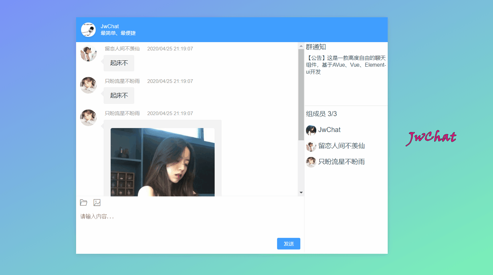

# JwChat

#### 介绍
**一款基于Vue和ElementUI极简的聊天框组件**
本项目是一款极简的数据驱动为主的聊天框组件



#### 安装

* 使用 `npm` 安装

  ``` bash
  npm install jwchat
  ```

* 使用 `yarn` 安装

  ``` bash
  yarn add jwchat
  ```

#### 使用

1. 因为本组件是基于 `element-ui` 开发。首先需要引入  `element-ui`。

   ```bash
   npm install element-ui
   ```

2. 在 `main.js` 中引入组件

   ``` js
   import ElementUI from 'element-ui';
   import 'element-ui/lib/theme-chalk/index.css';
   Vue.use(ElementUI);
   
   import Chat from 'jwchat';
   import 'jwchat/lib/JwChat.css';
   Vue.use(Chat)
   ```

3. 在 `*.vue` 中引入

   ``` vue
   <JwChat :taleList="taleList" @enter="bindEnter" v-model="inputMsg" :toolConfig="tool" />
   ```

   

* [chat组件文档](./document/api.md)

## 参数配置

---

### Attribute

| 参数       | 说明           | 类型   | 可选值 | 默认值 |
| ---------- | :------------- | ------ | ------ | ------ |
| v-model    | 输入框中的文字 | String | -      | ""     |
| taleList   | 会话内容       | Array  | -      | []     |
| toolConfig | 工具烂配置     | Object | -      | {}     |
| width      | 聊天框宽度     | string | -      | 550px  |
| height     | 聊天框高度     | string | -      | 500px  |

### Methods

| 参数  | 说明                               | 参数           |
| ----- | ---------------------------------- | -------------- |
| enter | 输入框点击就发送或者回车触发的事件 | 输入框中的文字 |
|       |                                    |                |


*  ####  `taleList`


``` json
// 格式
[
    {
        "date": "2020/04/25 21:19:07",
        "text": { "text": "起床不" },
        "mine": false,
        "name": "只盼流星不盼雨",
        "img": "image/two.jpeg"
    },
    {
        "date": "2020/04/16 21:19:07",
        "text": { "text": "我不饿" },
        "mine": true,
        "name": "留恋人间不羡仙",
        "img": "image/three.jpeg"
    },
]

// data 用来展示时间数据
// text 用来展示本条会话内容
// mine 本条数据是否是我发的
// img 用户头像
```

* #### `toolConfig` 

``` js
{
    // file img video 现在只配置了三个图标
    show: ['file', 'img'],
    callback: this.toolEvent
}
    
 toolEvent (type/* 当前点击的按钮类型 */) {
     alert(type)
 }    
```

#### 参与贡献

1.  Fork 本仓库
2.  新建 Feat_xxx 分支
3.  提交代码
4.  新建 Pull Request

#### 声明

* 本代码借鉴于[AVue](https://avuejs.com/)


#### 交流学习

* 球球群 ：235689934