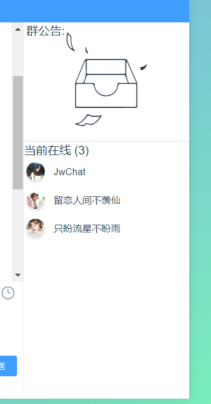

## 基本语法

---


``` xml
<JwChat-rightbox :config="rightConfig" @click="rightClick" />
```




## 参数配置

---

### Attribute

| 参数   | 说明           | 类型   | 可选值 | 默认值 |
| ------ | :------------- | ------ | ------ | ------ |
| config | 输入框中的文字 | Object | -      | -      |

### Methods

| 参数  | 说明                 | 参数       |
| ----- | -------------------- | ---------- |
| click | 点击列表触发回调函数 | 选中的节点 |


*  ####  `config`


``` json
// 格式
{
    tip: '群公告'，
    notice: '【公告】这是一款高度自由的聊天组件，基于AVue、Vue、Element-ui开发。点个赞再走吧 ',
    listTip: '当前在线',
    list: 
    [
        {
            name: 'JwChat',
            "img": "image/three.jpeg"
        },
        {
            name: '留恋人间不羡仙',
            "img": "image/one.jpeg"
        },
        {
            name: '只盼流星不盼雨',
            "img": "image/two.jpeg"
        }
    ]
},

```
