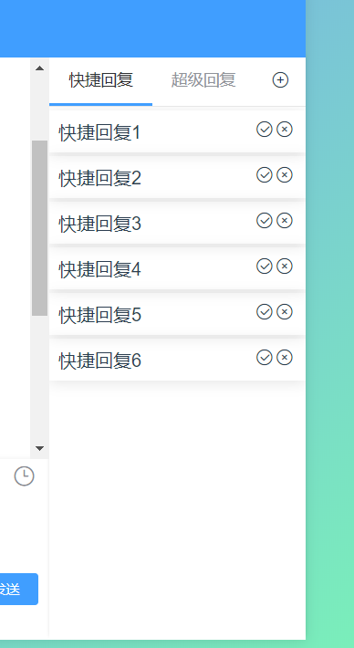

## 基本语法

---


``` xml
<JwChat-talk :Talelist="talk" :config="quickConfig" @event="bindTalk" />
```




## 参数配置

---

### Attribute

| 参数   | 说明         | 类型   | 可选值 | 默认值 |
| ------ | :----------- | ------ | ------ | ------ |
| talk   | 快捷回复内容 | Array  | -      | []     |
| config | 工具烂配置   | Object | -      | {}     |

### Methods

| 参数  | 说明             | 参数 |
| ----- | ---------------- | ---- |
| event | 组件点击选中事件 | {}   |


*  ####  `config`


``` json
// 格式
{
    nav: ['快捷回复', '超级回复'],
    showAddBtn: true,
    showHeader: true,
    showDeleteBtn: true,
}
```
